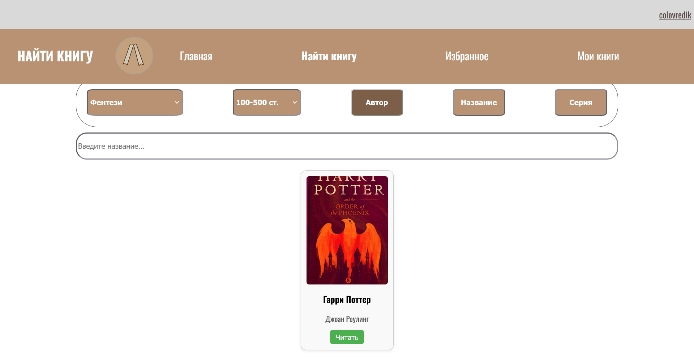

# Libra — веб-платформа для чтения электронных книг

Веб-приложение с клиент-серверной архитектурой, позволяющее пользователям искать, хранить и читать электронные книги. Проект включает авторизацию, личную библиотеку и загрузку файлов.

## Возможности

- **Каталог книг** с фильтрацией по жанру, автору, серии и объёму страниц
- **Поиск** с выпадающими подсказками без дублей
- **Регистрация и авторизация** с хешированием паролей (bcrypt)
- **Сессии пользователей** (express-session) с защитой приватных страниц
- **Избранное** с привязкой к аккаунту
- **Личная библиотека** с загрузкой PDF и обложек на сервер
- **Чтение PDF** прямо в браузере
- **Адаптивный интерфейс** с поддержкой мобильных устройств

## Технологии

| Слой | Технологии |
|------|------------|
| Frontend | HTML5, CSS3, JavaScript (ES6+) |
| Backend | Node.js, Express.js |
| База данных | SQLite |
| Безопасность | bcrypt, express-session |
| Логирование | morgan |
| Конфигурация | dotenv |

## Установка и запуск

### Требования
- Node.js (версия 14 или выше)
- npm

### Шаги

1. Клонируйте репозиторий: 
```
git clone https://github.com/colovredik/libra
```


2. Перейдите в папку проекта:
```
cd libra
```


3. Установите зависимости:
```
npm install
```


4. Создайте файл `.env` в корне проекта:
```
PORT=3000
SESSION_SECRET=your_secret_key
```


5. Запустите сервер:
```
node server.js
```

## API

| Метод | Эндпоинт | Описание |
|-------|----------|----------|
| GET | `/books` | Получить список всех книг |
| GET | `/books/:id` | Получить информацию о книге |
| POST | `/register` | Регистрация нового пользователя |
| POST | `/login` | Вход в аккаунт |
| POST | `/logout` | Выход из аккаунта |
| GET | `/favorites` | Получить избранное пользователя |
| POST | `/favorites` | Добавить книгу в избранное |
| DELETE | `/favorites/:id` | Удалить книгу из избранного |
| GET | `/me` | Получить данные текущего пользователя |
| POST | `/my-books` | Загрузить книгу в личную библиотеку |

## Структура проекта

```
libra/
├── pages/          # HTML-страницы
├── scripts/        # Клиентский JavaScript
├── styles/         # CSS-стили
├── libra_data/     # База данных SQLite
├── uploads/        # Загруженные файлы (PDF, обложки)
├── server.js       # Серверная часть (Express)
├── package.json    # Зависимости
└── .env.example    # Образец переменных окружения
```

## Скриншоты

| Главная | Книга | Библиотека |
|---------|-------|------------|
|  |  |  |